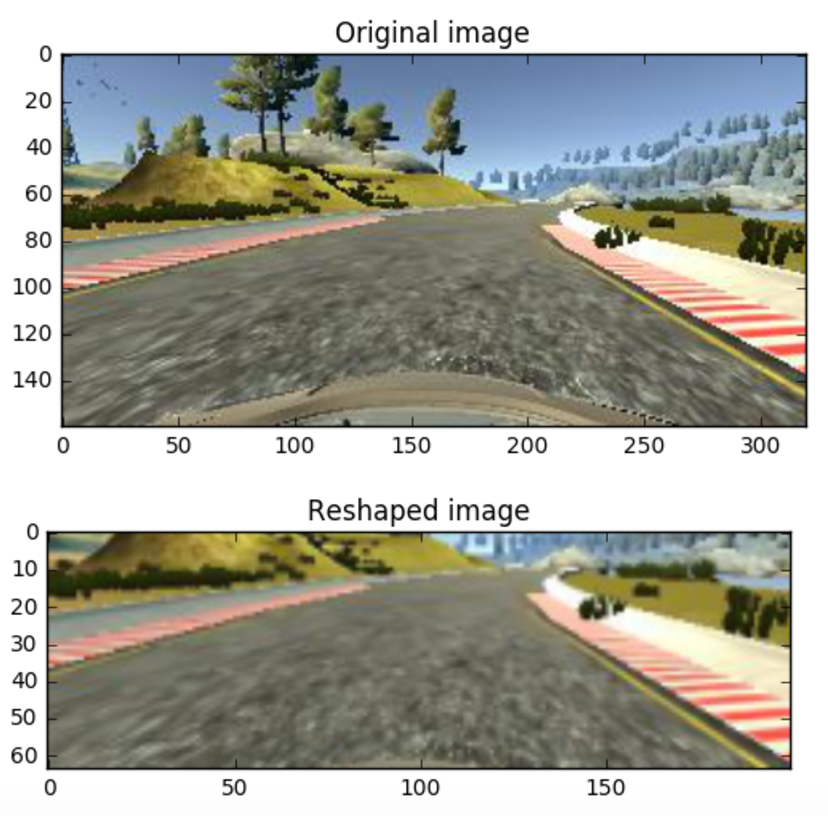
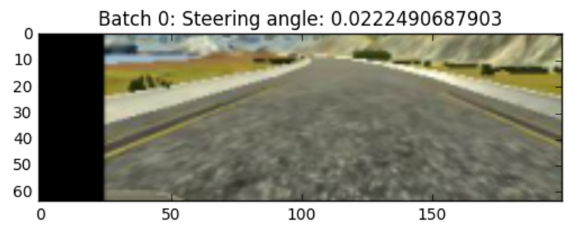
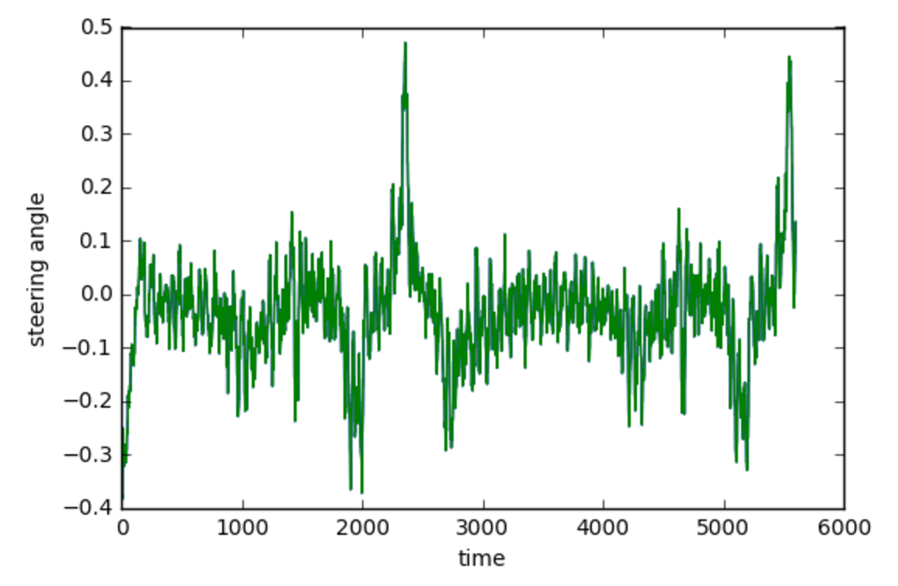

# Self-Driving Car Engineer Nanodegree
# Deep Learning
## Project: Behavorial Cloning

### Goal:
Use deep learning to teach a car how to drive using the simulator provided by Udacity.

### Dataset:
Although it is possible to generate data with the simulator, I wasn't able to drive the car well enough with my laptop keyboard to get good data. Therefore, I used the dataset provided by Udacity.
Dataset description: images from 3 different cameras placed at the center, left and right of the car and their associated steering angle, throttle and speed.

### Data analysis:
- Some points in the dataset were recorded with a very low speed. These may be outliers and I decided to remove them.
- Uneven distribution of steering angles: there are more sharper left turns in the data set. Also, there is a huge peak around 0, which means that the model may have a bias to go straight. If we include the left and right cameras with an steering angle offset, this can fix the problem.

### Validation set:
In order to pick the best model and avoid overfitting, 10% of the training dataset was randomly selected for validation.
- Total number of examples: 7332
- Training examples: 6598
- Validation examples: 734

### Model description:
I implemented the model described in the [NVIDIA paper](http://images.nvidia.com/content/tegra/automotive/images/2016/solutions/pdf/end-to-end-dl-using-px.pdf) in Keras. I used the same layers but fed RGB images instead of YUV images since RGB images gave better results.

- I used an Adam optimizer with learning rate of 10e-4.
- Metrics to optimize: minimize mean_squared_error.
- I used a batch generator in Keras in order to generate more random images from the dataset. 
- I used Keras' ModelCheckpoint to save model weights after each epoch. This was useful since I realized that the validation loss was not always better correlated to the performance on the track.

### Data preparation:
- I cropped the 20 pixels at the bottom of the image to hide the car and 50 pixels at the top to remove information about the environment such as the sky.
- I resized the images to 64x200x3 since that's the expected input for the NVIDIA model.

The original dataset includes only around 7,000 images.
My first try using center camera images only without additional data generation performed poorly. 
I then decided to generate additional data in this chronological order:
- Horizontal flip of the image and take the opposite of the steering angle.
- Translate the image horizontally by a random number of pixels from 0 to 50 pixels in each direction. For each translated pixel, I adjusted the steering angle by 0.008 degres. After trying different values of the adjustment factor from 0.001 to 0.01 degres per pixel, I chose 0.008 since it provided the best results.

- Use images from all 3 cameras and adjust the steering angle for left/right images. I've tried many different values for the adjustment factor, from 0.1 to 0.5. 0.3 was the adjustment angle that provided the best results.

### Model training:
I included around 28,160 examples in each epoch.
I ran the model for at most 10 epochs. I initially selected the model with the lowest validation loss. However, after noticing that some of my earlier models with less data generation had lower validation loss by performed worse on the track, I started to test the simulator for models at different epochs from the one with the lowest validation loss.

I was able to train the model locally on my MacBook Pro in less than 3 minutes per epoch, so 30 minutes total for 10 epochs.

Note: validation loss can be lower that the training loss because training includes more data transformation. Validation only includes the 3 cameras without data augmentation (i.e. no horizontal flipping, no random translation etc.). This choice was made so that I could compare the validation loss across different models.

- Plot of training and validation loss (mean_squared_error)

- Plot of the steering angles of the car driving on the 1st track using my best model

### Output of first and second convoluational layers
For image resized above:
- Output of First convolutional layer:

- Output of Second convolutional layer:

### Other data generation tried that did not work:
- Change brightness
- Add image rotation
- Convert image to YUV space

### Running the simulation:
I updated the drive.py file to make the necessary image transformations to the input image before feeding it to the model: crop top and bottom of image and resize it to 200x64x3.

### Observations:
More zigzags at higher speeds
Track 2: increased throttle to make the car go up the hill
Surprised at how picky the model is. A small adjustment in the parameters can make it work.
Some models have lower validation losses but perform poorly on the track.
Simulator not performing well when other applications are running as well (e.g. training another model)
When using the silmulator at higher screen resolutions, the model performs as well.
When using the silmulator with highest graphic quality, my laptop struggles and the model does not perform as well. We could generate random shadows to improve it.

### Images source:
Check out model.ipynb to see the code that generates the images included in this README.

### Architecture of project:
- Train model: Run `python model.py`
- Final model saved weights: model.h5
- Final model saved architecture: model.json
- model.ipynb has the code to generate the graphs
- model.py is used to generate the steering angles used by the simulator
